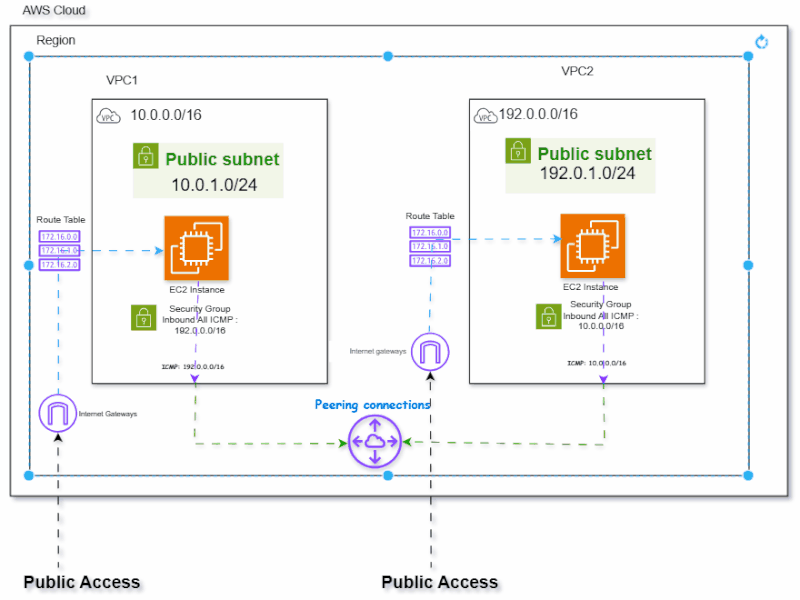
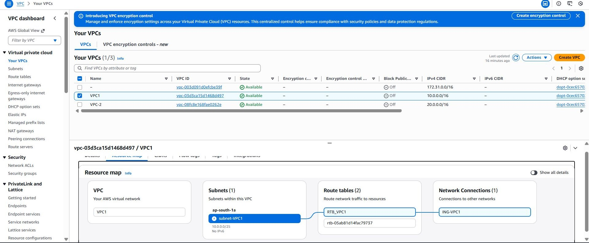
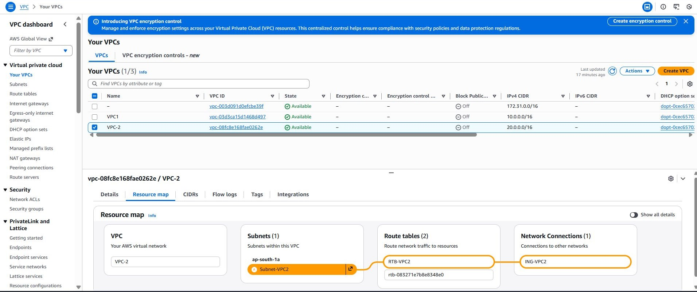
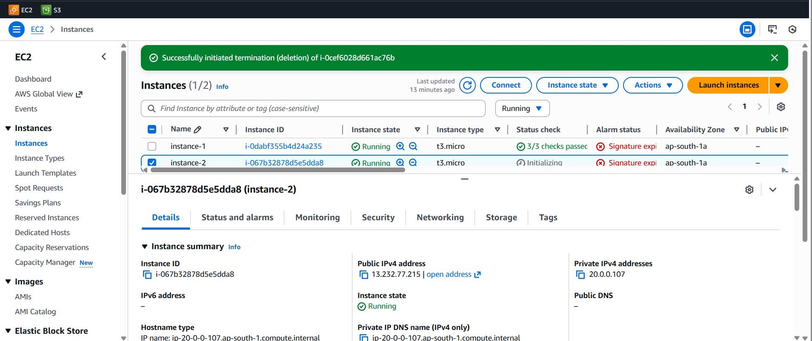
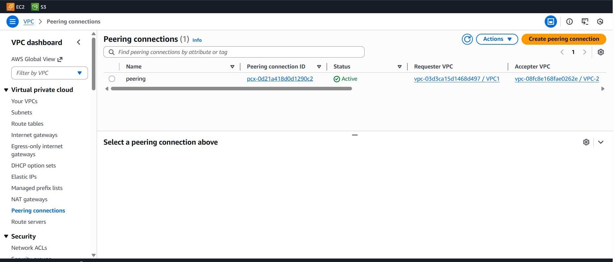

  <h1 align="center"><b>🚀Secure & Scalable 3-Tier Architecture with VPC Isolation & Peering</b></h1>

📌 Project Overview
This project demonstrates a real‑world AWS VPC Peering implementation used to securely connect two isolated Virtual Private Clouds (VPCs) in a 3‑tier architecture. The setup enables private communication between EC2 instances across VPCs without using the public internet, following AWS best practices for networking, routing, and security.
This project demonstrates how to manually create and configure **VPC Peering** between two Virtual Private Clouds (VPCs) on AWS. It covers VPC creation, subnet configuration, routing changes, security settings, and connectivity testing using EC2 instances.

S – Situation

To strengthen my networking and architecture fundamentals, I decided to build a secure and scalable 3-tier architecture similar to real enterprise environments.

T – Task

My goal was to design an architecture with strict network isolation, secure communication between tiers, and monitoring of infrastructure health.

A – Action

I created a VPC with separate public and private subnets for the web, application, and database tiers.
Configured security groups, NACLs, and routing tables to ensure least-privilege access.
Implemented VPC Peering to connect multiple VPCs securely and enabled cross-VPC communication.
Used CloudWatch dashboards and alarms to track performance metrics and system health.

R – Result

The architecture achieved strong network isolation, secure cross-tier communication, and clear monitoring visibility.
This project deepened my understanding of AWS networking, security controls, and architecture patterns used in production systems.

🏗️ **Architecture Overview**

## VPC Peering – Traffic Flow (Animated)

Two VPCs were created **manually**:

- **VPC-A (Prod-VPC)**  
  CIDR: `10.0.0.0/16`  
  Subnet: `10.0.1.0/24` (Public)

- **VPC-B (Dev-VPC)**  
  CIDR: `192.168.0.0/16`  
  Subnet: `192.168.1.0/24` (Public)

A **VPC Peering Connection** was created between these two VPCs to enable private communication without using the internet.

---

📍 **Region Used**
- `ap-south-1` (Mumbai)

---

🔧 **Resources Created Manually**
✔️ VPCs  
✔️ Subnets  
✔️ Internet Gateways  
✔️ Route Tables  
✔️ Security Groups  
✔️ EC2 Instances (one in each VPC)  
✔️ VPC Peering Connection  
✔️ Route Table Propagation (Manual Updates)  
✔️ Connectivity Testing  

---

🔄 **Project Flow / Steps Performed**

 **1️⃣ Create Two VPCs**
- VPC-A (10.0.0.0/16)  
- VPC-B (192.168.0.0/16)

  

 **2️⃣ Create Subnets**
- Subnet in VPC-A → `10.0.1.0/24`  
- Subnet in VPC-B → `192.168.1.0/24`

 **3️⃣ Attach Internet Gateways**
- Create IGW for each VPC  
- Attach them to VPC-A and VPC-B

**4️⃣ Configure Route Tables**
- Associate subnets with their respective route tables  
- Add route `0.0.0.0/0` → IGW for internet access
  
  

 **5️⃣ Launch EC2 Instances**
- One EC2 instance in VPC-A  
- One EC2 instance in VPC-B  
- Allow SSH (port 22)  
- Allow ICMP (ping)
  
  

**6️⃣ Create VPC Peering Connection**
- Requester: VPC-A  
- Accepter: VPC-B  
- Accept the peering request  
- Check that status becomes **Active**

  

**7️⃣ Update Route Tables for Peering**
- In VPC-A Routes → Add route to `192.168.0.0/16` via Peering ID  
- In VPC-B Routes → Add route to `10.0.0.0/16` via Peering ID

**8️⃣ Modify Security Groups**
- Allow inbound ICMP from the other VPC’s CIDR  
- Allow SSH if required

---

 🧪 **Connectivity Testing**
- Successfully SSH’d into EC2 instances  
- Ping from **EC2-A → EC2-B** = ✔️ Success  
- Ping from **EC2-B → EC2-A** = ✔️ Success  

This confirms that **VPC Peering is working correctly**, and both instances are communicating privately without using the internet.

---

📘 **What I Learned**
- Understanding CIDR planning  
- Creating VPCs & subnets manually  
- How routing tables work  
- Private communication using VPC peering  
- Testing network connectivity  
- AWS networking fundamentals

🔐 Security Best Practices
- No internet exposure for private communication
- Security Groups restrict inbound/outbound traffic
- Separate route tables for isolation
- Least privilege networking access

📚 Key Learnings
- Deep understanding of AWS VPC networking
- Practical experience with VPC Peering
- Route table dependency in inter‑VPC traffic
- Real‑world troubleshooting of connectivity issues

🧠 Use Cases
- Microservices communication across VPCs
- Multi‑account AWS architectures
- Secure backend connectivity
- Hybrid and enterprise cloud designs

🚀 Future Enhancements
- Replace VPC Peering with Transit Gateway
- Add NAT Gateway for outbound access
- Implement Terraform / IaC
- Enable VPC Flow Logs

🧑‍💻 Author
     Nipun Bhardwaj
     Cloud Engineer | AWS | DevOps | Generative AI | Agengic AI engineer

📌 GitHub: https://github.com/nipun-10

⭐ If you found this project helpful, consider giving the repository a star!

